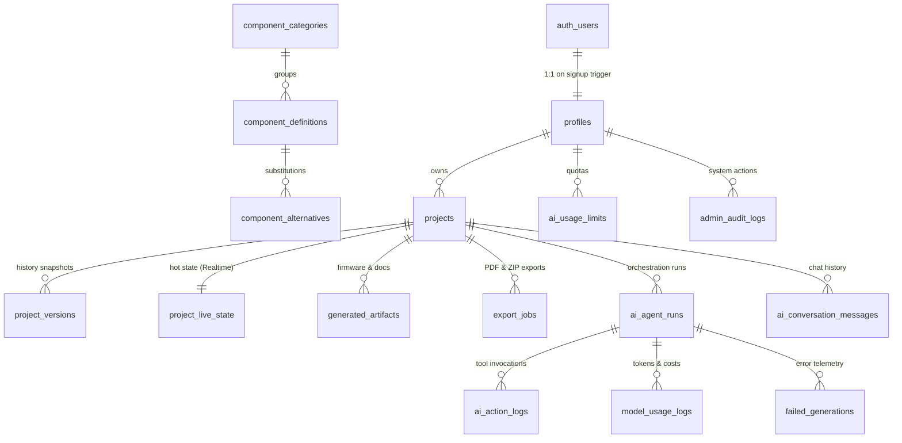

# 🗄️ Eureka — Database Architecture & Schema Reference

> **Canonical Data Model & PostgreSQL Reference (Supabase)**
> **Source Files:** `supabase/migrations/` (001–006) and `supabase/full_schema.sql`

---

## 🏛️ 1. Entity-Relationship (ER) Overview



---

## 📋 2. Comprehensive Table Dictionary

### Domain 1: Identity & Profiles (D1)

| Table        | Column           | Type            | Constraints                                                                     | Description                   |
| ------------ | ---------------- | --------------- | ------------------------------------------------------------------------------- | ----------------------------- |
| `profiles` | `id`           | `UUID`        | PK, FK ➔`auth.users(id)` ON DELETE CASCADE                                   | Matches Supabase Auth user ID |
|              | `display_name` | `TEXT`        | Nullable                                                                        | User's full name / handle     |
|              | `avatar_url`   | `TEXT`        | Nullable                                                                        | Profile avatar URL            |
|              | `role`         | `VARCHAR(20)` | NOT NULL, DEFAULT`'user'`, CHECK IN (`'user'`, `'admin'`)                 | RBAC flag                     |
|              | `usage_tier`   | `VARCHAR(20)` | NOT NULL, DEFAULT`'free'`, CHECK IN (`'free'`, `'pro'`, `'enterprise'`) | Billing / tier level          |
|              | `created_at`   | `TIMESTAMPTZ` | NOT NULL, DEFAULT`timezone('utc', now())`                                     | Creation timestamp            |
|              | `updated_at`   | `TIMESTAMPTZ` | NOT NULL, DEFAULT`timezone('utc', now())`                                     | Update timestamp              |

---

### Domain 2: Project Domain & Live State (D2)

| Table                            | Column                 | Type             | Constraints                                                                           | Description                                              |
| -------------------------------- | ---------------------- | ---------------- | ------------------------------------------------------------------------------------- | -------------------------------------------------------- |
| `project_categories`           | `id`                 | `VARCHAR(50)`  | PK                                                                                    | Category code (e.g.`'cat_iot'`, `'cat_robotics'`)    |
|                                  | `name`               | `VARCHAR(100)` | NOT NULL                                                                              | Human readable title                                     |
|                                  | `description`        | `TEXT`         | Nullable                                                                              | Category scope                                           |
| **`projects`**           | `id`                 | `UUID`         | PK, DEFAULT`gen_random_uuid()`                                                      | Unique project identifier                                |
|                                  | `owner_id`           | `UUID`         | NOT NULL, FK ➔`profiles(id)` ON DELETE CASCADE                                     | Project owner                                            |
|                                  | `title`              | `VARCHAR(120)` | NOT NULL                                                                              | Project title                                            |
|                                  | `description`        | `TEXT`         | Nullable                                                                              | Project summary                                          |
|                                  | `category_id`        | `VARCHAR(50)`  | FK ➔`project_categories(id)` ON DELETE SET NULL                                    | Category                                                 |
|                                  | `status`             | `VARCHAR(20)`  | NOT NULL, DEFAULT`'active'`, CHECK IN (`'active'`, `'archived'`, `'deleted'`) | Lifecycle status                                         |
|                                  | `is_favorite`        | `BOOLEAN`      | NOT NULL, DEFAULT`FALSE`                                                            | Favorite pin flag                                        |
|                                  | `share_token`        | `VARCHAR(64)`  | UNIQUE, Nullable                                                                      | Read-only public sharing link token                      |
|                                  | `current_version_id` | `UUID`         | FK ➔`project_versions(id)` DEFERRABLE                                              | Pointer to latest version                                |
|                                  | `created_at`         | `TIMESTAMPTZ`  | NOT NULL, DEFAULT`timezone('utc', now())`                                           | Creation timestamp                                       |
|                                  | `updated_at`         | `TIMESTAMPTZ`  | NOT NULL, DEFAULT`timezone('utc', now())`                                           | Update timestamp                                         |
|                                  | `deleted_at`         | `TIMESTAMPTZ`  | Nullable                                                                              | Soft delete timestamp                                    |
| **`project_versions`**   | `id`                 | `UUID`         | PK, DEFAULT`gen_random_uuid()`                                                      | Version snapshot ID                                      |
|                                  | `project_id`         | `UUID`         | NOT NULL, FK ➔`projects(id)` ON DELETE CASCADE                                     | Parent project                                           |
|                                  | `version_number`     | `INT`          | NOT NULL                                                                              | Sequential version (1, 2, 3...)                          |
|                                  | `circuit_state`      | `JSONB`        | NOT NULL                                                                              | Immutable full CircuitGraph JSON snapshot                |
|                                  | `change_summary`     | `TEXT`         | Nullable                                                                              | Human readable summary of mutation                       |
|                                  | `created_by`         | `JSONB`        | NOT NULL                                                                              | Actor shape (`actor_type`, `user_id`, `ai_run_id`) |
|                                  | `parent_version_id`  | `UUID`         | FK ➔`project_versions(id)` ON DELETE SET NULL                                      | Previous version                                         |
|                                  | `created_at`         | `TIMESTAMPTZ`  | NOT NULL, DEFAULT`timezone('utc', now())`                                           | Snapshot creation timestamp                              |
| **`project_live_state`** | `project_id`         | `UUID`         | PK, FK ➔`projects(id)` ON DELETE CASCADE                                           | Single row per project (**Realtime target**)       |
|                                  | `circuit_state`      | `JSONB`        | NOT NULL                                                                              | Hot live CircuitGraph                                    |
|                                  | `validation_summary` | `JSONB`        | DEFAULT`{"is_valid": true, "findings": []}`                                         | Real-time electrical validation status                   |
|                                  | `bom_summary`        | `JSONB`        | DEFAULT`{"items": [], "total_cost": 0.0}`                                           | Real-time BOM and price derivation                       |
|                                  | `last_mutation`      | `JSONB`        | Nullable                                                                              | Last mutation payload                                    |
|                                  | `last_actor`         | `JSONB`        | Nullable                                                                              | Actor attribution of last edit                           |
|                                  | `updated_at`         | `TIMESTAMPTZ`  | NOT NULL, DEFAULT`timezone('utc', now())`                                           | Last mutation timestamp                                  |

---

### Domain 3: Component Catalog & Search (D3)

| Table                                | Column                         | Type               | Constraints                                  | Description                                         |
| ------------------------------------ | ------------------------------ | ------------------ | -------------------------------------------- | --------------------------------------------------- |
| `component_categories`             | `id`                         | `VARCHAR(50)`    | PK                                           | Category ID (e.g.`'mcu'`, `'sensors'`)          |
|                                      | `name`                       | `VARCHAR(100)`   | NOT NULL                                     | Category name                                       |
|                                      | `description`                | `TEXT`           | Nullable                                     | Description                                         |
|                                      | `sort_order`                 | `INT`            | NOT NULL, DEFAULT 0                          | UI display order                                    |
| **`component_definitions`**  | `id`                         | `UUID`           | PK, DEFAULT`gen_random_uuid()`             | Catalog component ID                                |
|                                      | `name`                       | `VARCHAR(120)`   | NOT NULL                                     | e.g. "ESP32 DevKit V1"                              |
|                                      | `category_id`                | `VARCHAR(50)`    | NOT NULL, FK ➔`component_categories(id)`  | Category                                            |
|                                      | `purpose`                    | `TEXT`           | NOT NULL                                     | Function description for search & AI                |
|                                      | `manufacturer`               | `VARCHAR(100)`   | Nullable                                     | Manufacturer name                                   |
|                                      | `part_number`                | `VARCHAR(100)`   | Nullable                                     | MPN / Part number                                   |
|                                      | `structured_pins`            | `JSONB`          | NOT NULL, DEFAULT`'[]'`                    | Pin names, roles, and viewBox`(x, y)` positions   |
|                                      | `electrical_characteristics` | `JSONB`          | NOT NULL, DEFAULT`'{}'`                    | Voltage ranges, current limits, logic levels        |
|                                      | `unit_price`                 | `NUMERIC(10, 4)` | NOT NULL, DEFAULT`0.0000`                  | Price per unit                                      |
|                                      | `currency`                   | `VARCHAR(3)`     | NOT NULL, DEFAULT`'USD'`                   | Currency code                                       |
|                                      | `is_available`               | `BOOLEAN`        | NOT NULL, DEFAULT`TRUE`                    | Stock availability                                  |
|                                      | `asset_key`                  | `TEXT`           | Nullable                                     | Cloudflare R2 path to SVG                           |
|                                      | `view_box`                   | `JSONB`          | DEFAULT`{"width": 120, "height": 120}`     | SVG dimension bounding box                          |
|                                      | `confidence`                 | `VARCHAR(20)`    | NOT NULL, DEFAULT`'verified'`              | `'verified'`, `'ai_extracted'`, `'community'` |
|                                      | `search_vector`              | `TSVECTOR`       | **GENERATED ALWAYS STORED**            | Full-text search vector (name + purpose + MPN)      |
| **`component_alternatives`** | `id`                         | `UUID`           | PK, DEFAULT`gen_random_uuid()`             | Substitute relationship                             |
|                                      | `component_id`               | `UUID`           | NOT NULL, FK ➔`component_definitions(id)` | Primary component                                   |
|                                      | `alternative_component_id`   | `UUID`           | NOT NULL, FK ➔`component_definitions(id)` | Compatible substitute                               |
|                                      | `reason`                     | `TEXT`           | Nullable                                     | Reason (e.g. "Lower cost alternative")              |
|                                      | `price_difference_note`      | `TEXT`           | Nullable                                     | Cost delta notes                                    |

---

### Domain 4: Derived Artifacts & Exports (D4)

| Table                             | Column            | Type            | Constraints                                                                                               | Description                                                                     |
| --------------------------------- | ----------------- | --------------- | --------------------------------------------------------------------------------------------------------- | ------------------------------------------------------------------------------- |
| **`generated_artifacts`** | `id`            | `UUID`        | PK, DEFAULT`gen_random_uuid()`                                                                          | Artifact ID                                                                     |
|                                   | `project_id`    | `UUID`        | NOT NULL, FK ➔`projects(id)` ON DELETE CASCADE                                                         | Associated project                                                              |
|                                   | `version_id`    | `UUID`        | FK ➔`project_versions(id)` ON DELETE CASCADE                                                           | Source version                                                                  |
|                                   | `artifact_type` | `VARCHAR(50)` | NOT NULL                                                                                                  | `'firmware_arduino'`, `'firmware_esp32'`, `'wiring_guide'`, `'bom_csv'` |
|                                   | `content`       | `TEXT`        | Nullable                                                                                                  | Inline source code or markdown                                                  |
|                                   | `storage_key`   | `TEXT`        | Nullable                                                                                                  | Cloudflare R2 path for larger renders                                           |
|                                   | `is_stale`      | `BOOLEAN`     | NOT NULL, DEFAULT`FALSE`                                                                                | Staleness flag (set on circuit mutation)                                        |
| **`export_jobs`**         | `id`            | `UUID`        | PK, DEFAULT`gen_random_uuid()`                                                                          | Export task ID                                                                  |
|                                   | `project_id`    | `UUID`        | NOT NULL, FK ➔`projects(id)` ON DELETE CASCADE                                                         | Project                                                                         |
|                                   | `requester_id`  | `UUID`        | NOT NULL, FK ➔`profiles(id)`                                                                           | User requesting export                                                          |
|                                   | `format`        | `VARCHAR(20)` | NOT NULL, CHECK IN (`'pdf'`, `'svg'`, `'png'`, `'zip'`, `'json'`)                               | Requested format                                                                |
|                                   | `status`        | `VARCHAR(20)` | NOT NULL, DEFAULT`'pending'`, CHECK IN (`'pending'`, `'processing'`, `'completed'`, `'failed'`) | Job status                                                                      |
|                                   | `storage_key`   | `TEXT`        | Nullable                                                                                                  | Cloudflare R2 private bucket key                                                |
|                                   | `download_url`  | `TEXT`        | Nullable                                                                                                  | Signed / backend download link                                                  |
|                                   | `error_message` | `TEXT`        | Nullable                                                                                                  | Failure reason if failed                                                        |

---

### Domain 5: AI Orchestration & Telemetry (D5)

| Table                                  | Column                        | Type               | Constraints                                                                                                                 | Description                                                 |
| -------------------------------------- | ----------------------------- | ------------------ | --------------------------------------------------------------------------------------------------------------------------- | ----------------------------------------------------------- |
| **`ai_agent_runs`**            | `id`                        | `UUID`           | PK, DEFAULT`gen_random_uuid()`                                                                                            | Run ID                                                      |
|                                        | `project_id`                | `UUID`           | NOT NULL, FK ➔`projects(id)` ON DELETE CASCADE                                                                           | Project                                                     |
|                                        | `user_id`                   | `UUID`           | NOT NULL, FK ➔`profiles(id)` ON DELETE CASCADE                                                                           | Invoking user                                               |
|                                        | `thread_id`                 | `VARCHAR(100)`   | NOT NULL                                                                                                                    | Direct LangGraph checkpoint thread ID                       |
|                                        | `run_type`                  | `VARCHAR(50)`    | NOT NULL, CHECK IN (`'generation'`, `'modification'`, `'clarification'`)                                              | Graph mode                                                  |
|                                        | `prompt`                    | `TEXT`           | NOT NULL                                                                                                                    | User's natural language request                             |
|                                        | `status`                    | `VARCHAR(30)`    | NOT NULL, DEFAULT`'in_progress'`, CHECK IN (`'in_progress'`, `'completed'`, `'clarification_needed'`, `'failed'`) | Execution status                                            |
|                                        | `clarifying_question`       | `TEXT`           | Nullable                                                                                                                    | Question asked when interrupt triggered                     |
|                                        | `total_tokens`              | `INT`            | NOT NULL, DEFAULT 0                                                                                                         | Cumulative token consumption                                |
|                                        | `estimated_cost_usd`        | `NUMERIC(10, 6)` | NOT NULL, DEFAULT 0.000000                                                                                                  | Estimated API cost                                          |
| **`ai_action_logs`**           | `id`                        | `UUID`           | PK, DEFAULT`gen_random_uuid()`                                                                                            | Tool call ID                                                |
|                                        | `run_id`                    | `UUID`           | NOT NULL, FK ➔`ai_agent_runs(id)` ON DELETE CASCADE                                                                      | Parent AI run                                               |
|                                        | `project_id`                | `UUID`           | NOT NULL, FK ➔`projects(id)` ON DELETE CASCADE                                                                           | Project                                                     |
|                                        | `tool_name`                 | `VARCHAR(100)`   | NOT NULL                                                                                                                    | e.g.`add_component`, `connect_pins`, `search_catalog` |
|                                        | `tool_input`                | `JSONB`          | Nullable                                                                                                                    | Tool arguments                                              |
|                                        | `tool_output`               | `JSONB`          | Nullable                                                                                                                    | Tool return payload                                         |
|                                        | `before_version_id`         | `UUID`           | Nullable, FK ➔`project_versions(id)`                                                                                     | Snapshot before tool                                        |
|                                        | `after_version_id`          | `UUID`           | Nullable, FK ➔`project_versions(id)`                                                                                     | Snapshot after tool                                         |
|                                        | `model_used`                | `VARCHAR(100)`   | Nullable                                                                                                                    | e.g.`'gemini-2.0-flash'`                                  |
| **`ai_conversation_messages`** | `id`                        | `UUID`           | PK, DEFAULT`gen_random_uuid()`                                                                                            | Chat message ID                                             |
|                                        | `project_id`                | `UUID`           | NOT NULL, FK ➔`projects(id)` ON DELETE CASCADE                                                                           | Project workspace chat                                      |
|                                        | `run_id`                    | `UUID`           | Nullable, FK ➔`ai_agent_runs(id)`                                                                                        | Triggering AI run                                           |
|                                        | `sender`                    | `VARCHAR(20)`    | NOT NULL, CHECK IN (`'user'`, `'ai'`, `'system'`)                                                                     | Message source                                              |
|                                        | `message_type`              | `VARCHAR(30)`    | NOT NULL, DEFAULT`'chat'`, CHECK IN (`'chat'`, `'clarification_prompt'`, `'clarification_response'`, `'error'`)   | Message category                                            |
|                                        | `content`                   | `TEXT`           | NOT NULL                                                                                                                    | Chat body text                                              |
|                                        | `metadata`                  | `JSONB`          | NOT NULL, DEFAULT`'{}'`                                                                                                   | Extra tags / UI actions                                     |
| **`model_usage_logs`**         | `id`                        | `UUID`           | PK, DEFAULT`gen_random_uuid()`                                                                                            | Granular LLM call log                                       |
|                                        | `run_id`                    | `UUID`           | NOT NULL, FK ➔`ai_agent_runs(id)` ON DELETE CASCADE                                                                      | Parent run                                                  |
|                                        | `provider`                  | `VARCHAR(50)`    | NOT NULL                                                                                                                    | `'gemini'`, `'anthropic'`                               |
|                                        | `model_name`                | `VARCHAR(100)`   | NOT NULL                                                                                                                    | Model identifier                                            |
|                                        | `node_name`                 | `VARCHAR(100)`   | NOT NULL                                                                                                                    | LangGraph graph node                                        |
|                                        | `input_tokens`              | `INT`            | NOT NULL, DEFAULT 0                                                                                                         | Prompt tokens                                               |
|                                        | `output_tokens`             | `INT`            | NOT NULL, DEFAULT 0                                                                                                         | Completion tokens                                           |
|                                        | `latency_ms`                | `INT`            | Nullable                                                                                                                    | Response latency in ms                                      |
|                                        | `estimated_cost_usd`        | `NUMERIC(10, 6)` | NOT NULL, DEFAULT 0.000000                                                                                                  | Calculated cost                                             |
| **`ai_usage_limits`**          | `user_id`                   | `UUID`           | PK, FK ➔`profiles(id)` ON DELETE CASCADE                                                                                 | User ID                                                     |
|                                        | `monthly_token_limit`       | `INT`            | NOT NULL, DEFAULT 500000                                                                                                    | Monthly token quota                                         |
|                                        | `monthly_tokens_consumed`   | `INT`            | NOT NULL, DEFAULT 0                                                                                                         | Tokens used this period                                     |
|                                        | `monthly_cost_limit_usd`    | `NUMERIC(10, 2)` | NOT NULL, DEFAULT 5.00                                                                                                      | Monthly spend cap                                           |
|                                        | `monthly_cost_consumed_usd` | `NUMERIC(10, 4)` | NOT NULL, DEFAULT 0.0000                                                                                                    | Dollar spend this period                                    |
|                                        | `reset_at`                  | `TIMESTAMPTZ`    | NOT NULL                                                                                                                    | Monthly reset timestamp                                     |

---

### Domain 6: Admin & Operations (D6)

| Table                            | Column           | Type             | Constraints                      | Description                                      |
| -------------------------------- | ---------------- | ---------------- | -------------------------------- | ------------------------------------------------ |
| **`admin_audit_logs`**   | `id`           | `UUID`         | PK, DEFAULT`gen_random_uuid()` | Audit log ID                                     |
|                                  | `admin_id`     | `UUID`         | NOT NULL, FK ➔`profiles(id)`  | Admin user                                       |
|                                  | `action`       | `VARCHAR(100)` | NOT NULL                         | Administrative action performed                  |
|                                  | `target_type`  | `VARCHAR(50)`  | Nullable                         | Resource type                                    |
|                                  | `target_id`    | `VARCHAR(100)` | Nullable                         | Resource ID                                      |
|                                  | `details`      | `JSONB`        | DEFAULT`'{}'`                  | Snapshot of change                               |
|                                  | `ip_address`   | `VARCHAR(45)`  | Nullable                         | Client IP                                        |
| **`failed_generations`** | `id`           | `UUID`         | PK, DEFAULT`gen_random_uuid()` | Failure log ID                                   |
|                                  | `project_id`   | `UUID`         | Nullable                         | Project ID                                       |
|                                  | `run_id`       | `UUID`         | Nullable                         | AI run ID                                        |
|                                  | `stage`        | `VARCHAR(100)` | NOT NULL                         | e.g.`'circuit_construction'`, `'validation'` |
|                                  | `user_prompt`  | `TEXT`         | Nullable                         | Context / user prompt                            |
|                                  | `error_detail` | `TEXT`         | NOT NULL                         | Raw exception / error message                    |
|                                  | `stack_trace`  | `TEXT`         | Nullable                         | Full Python stack trace                          |

---

## 🔒 3. Row-Level Security (RLS) Policy Matrix (D7)

| Table                        | SELECT                                                                    | INSERT                             | UPDATE                                            | DELETE                 |
| ---------------------------- | ------------------------------------------------------------------------- | ---------------------------------- | ------------------------------------------------- | ---------------------- |
| `profiles`                 | Own row (`id = auth.uid()`) OR Admin                                    | Trigger only (`handle_new_user`) | Own row (`id = auth.uid()`) without role change | Admin only             |
| `project_categories`       | Public (`TRUE`)                                                         | Admin only                         | Admin only                                        | Admin only             |
| `projects`                 | Owner (`owner_id = auth.uid()`) OR `share_token IS NOT NULL` OR Admin | Owner (`owner_id = auth.uid()`)  | Owner OR Admin                                    | Owner OR Admin         |
| `project_versions`         | Project Owner OR Admin                                                    | Project Owner OR Admin             | Project Owner OR Admin                            | Project Owner OR Admin |
| `project_live_state`       | Project Owner OR Admin                                                    | Project Owner OR Admin             | Project Owner OR Admin                            | Project Owner OR Admin |
| `component_categories`     | Public (`TRUE`)                                                         | Admin only                         | Admin only                                        | Admin only             |
| `component_definitions`    | Public (`TRUE`)                                                         | Admin only                         | Admin only                                        | Admin only             |
| `component_alternatives`   | Public (`TRUE`)                                                         | Admin only                         | Admin only                                        | Admin only             |
| `generated_artifacts`      | Project Owner OR Admin                                                    | Project Owner OR Admin             | Project Owner OR Admin                            | Project Owner OR Admin |
| `export_jobs`              | Requester (`requester_id = auth.uid()`) OR Admin                        | Requester OR Admin                 | Requester OR Admin                                | Requester OR Admin     |
| `ai_agent_runs`            | Run Owner (`user_id = auth.uid()`) OR Admin                             | Run Owner OR Admin                 | Run Owner OR Admin                                | Run Owner OR Admin     |
| `ai_action_logs`           | Project Owner OR Admin                                                    | Project Owner OR Admin             | Project Owner OR Admin                            | Project Owner OR Admin |
| `ai_conversation_messages` | Project Owner OR Admin                                                    | Project Owner OR Admin             | Project Owner OR Admin                            | Project Owner OR Admin |
| `model_usage_logs`         | Admin only                                                                | Service role / Admin               | Service role / Admin                              | Admin only             |
| `ai_usage_limits`          | Own user (`user_id = auth.uid()`) OR Admin                              | Service role / Trigger             | Service role / Admin                              | Admin only             |
| `admin_audit_logs`         | Admin only                                                                | Admin only                         | Admin only                                        | Admin only             |
| `failed_generations`       | Admin only                                                                | Service role / Admin               | Admin only                                        | Admin only             |

---


## 🧪 4. How to Verify the Database in Supabase

After running the schema script, paste and run the following verification queries in the Supabase SQL Editor to confirm everything is configured properly:

### Verification Query 1: Verify All 17 Tables Exist & Have RLS Enabled

```sql
SELECT 
    schemaname, 
    tablename, 
    rowsecurity AS rls_enabled 
FROM pg_tables 
WHERE schemaname = 'public'
ORDER BY tablename;
```

* **Expected Result:** Exactly 17 tables returned, with `rls_enabled = true` on every row.

---

### Verification Query 2: Verify Full-Text Search on Component Catalog

```sql
SELECT 
    name, 
    category_id, 
    unit_price, 
    currency 
FROM public.component_definitions 
WHERE search_vector @@ to_tsquery('english', 'esp32 | moisture');
```

* **Expected Result:** Returns the `ESP32 DevKit V1` and `Capacitive Soil Moisture Sensor v1.2` rows instantly via the GIN search index.

---

### Verification Query 3: Verify Supabase Realtime Publication

```sql
SELECT 
    pubname, 
    schemaname, 
    tablename 
FROM pg_publication_tables 
WHERE pubname = 'supabase_realtime';
```

* **Expected Result:** Returns a row with `tablename = 'project_live_state'`.

---

### Verification Query 4: Verify Trigger on New User Signup

```sql
SELECT 
    event_object_table, 
    trigger_name, 
    action_timing, 
    event_manipulation 
FROM information_schema.triggers 
WHERE trigger_name = 'on_auth_user_created';
```

* **Expected Result:** Confirms trigger `on_auth_user_created` is attached to `auth.users` on `AFTER INSERT`.
